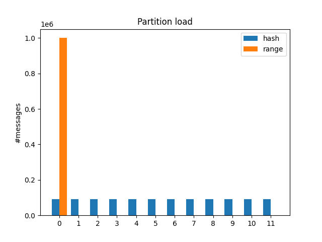

# Chapter 6: Partitioning

## Lab A: Hash vs Range Partitioning

### 1. Start the containers:
```
cd labA
docker compose up -d
```

### 2. Create topics with 12 partitions each
```
docker exec -it $(docker compose ps -q kafka) kafka-topics.sh --bootstrap-server localhost:9092 --create --topic hash_topic --partitions 12 --replication-factor 1
docker exec -it $(docker compose ps -q kafka) kafka-topics.sh --bootstrap-server localhost:9092 --create --topic range_topic --partitions 12 --replication-factor 1
```

Verify topics are created:
```
docker exec -it $(docker compose ps -q kafka) kafka-topics.sh --bootstrap-server localhost:9092 --list
```

### 3. Run the producer

Create Python venv and install deps:
```
python -m venv .venv
.\.venv\Scripts\Activate.ps1
pip install -r requirements.txt
```

### 4. Get per-partition stats
```
python count_offsets.py
python chart.py
```

 

### 5. Cleanup
```
deactivate
docker compose down
```
